```{r setup, include = FALSE}
knitr::opts_chunk$set(echo = FALSE, message = FALSE, warning = FALSE, htmltools.dir.version = FALSE)
xaringanExtra::use_xaringan_extra(c("tile_view", # O
                                    "broadcast", 
                                    "panelset",
                                    "tachyons"))
library(pacman)
# Functions preload
set.seed(19970921)
```


class: inverse, bottom

# 思想政治教育：一个政治宣传的视角

???

尊敬的老师，同学们大家晚上好，我是来自清华大学政治学系的博士生孙宇飞，今天向大家汇报的内容是和教育部职业汤霓老师一起合作的文章“教育式宣传与宣传式教育：政治宣传效果的整合性框架”

---

## 思想政治教育：一个政治宣传的视角
.pull-left[

.center[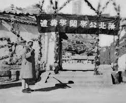]

]

--


.pull-right[

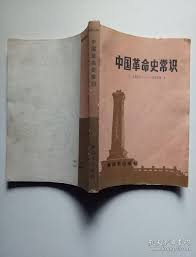

]

--

.center[思政课是.red[落实立德树人根本任务的关键课程]，思政课作用不可替代]

.right[——习近平，在学校思想政治理论课教师座谈会上的讲话]

???

从革命时期的陕北公学到新中国成立后在中学开设"中国革命常识"、"共同纲领"等课程；再到改革开放后，不断推动思政课改革。中国共产党历来都高度重视思想政治教育。


---

class: inverse, bottom

# 学习 .huge[&#8799;] 习得

???

但是学了并不等于习得

---

class: center, middle

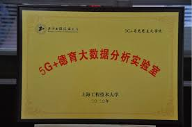 .huge[vs.] 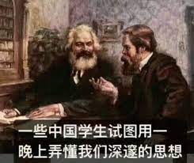

???

一方面各种形式的思政课层出不穷，另一方面，学生的接受度、抬头率也值得关注


--

&dArr;    
.large[.red[如何] 讲好思政课？]

思政课对公众影响的.red[心理机制];

思政课的.red[形式]对教学效果的影响


???

如何讲好思政课，不仅要探索各种教学方式，还要了解思政课对公众影响的心理机制

---

## 思政课的迷思：一个政治宣传的视角

.center[
### 困惑： .red[如何]讲好思政课
]

???

政治宣传是政府维持统治合法性和提升公众支持的重要手段之一,思政课是中国政治宣传的重要方式。


--

.pull-left[

### 现有研究

- 政治宣传的公共影响

  - 灌输机制(JOWETT等, 2018; ARCENEAUX, 2020)
  
  - 信号机制(HUANG, 2015)


- 政治宣传的方式
  
  - "宣传"还是"知识"
  
  - 教师呈现方式
  
  - "思政课程"与"课程思政"
]

???

灌输机制是指政府通过媒体和教育等向社会发布对自己有利的知识或新闻，从而增加公众对自己的信任和支持 [@JowettODonnell2018]。

但是意识的改变并非易事，学者们注意到，政治宣传往往不是为了说服 [@Arendt2007]， @Huang2015a提出了政治宣传的信号机制，即使民众不喜欢、不相信政治宣传，但政府依然能够迫使民众接受宣传，这会使民众感受到国家的实力和能力，重新计算自己的反抗成本，从而减少对政府提出反对的意识和行动。换句话说，宣传不是塑造个人的政治偏好，而是通过影响他们对国家能力的感知来发挥作用。[@Huang2018]

政治宣传的方式也十分重要，教育领域历来就存在宣传和知识之争，Covid19的爆发和线上教学的普及，让人们开始关注教师呈现方式对教学效果的影响，近来提出的“课程思政”，即将思政知识融入到专业课学习中，就是对传统“思政课程”的一个探索。

--

.pull-right[
### 我们还不知道

1. 到底是什么样的信号? 🤔️
1. 课程思政和思政课程哪家强？ 👊

]

???

但这些研究对一些关键问题的回答还是模糊的：

信号机制的"信号"是模糊的，它让公众感受到国家掌握"大量资源的能力和向社会强加宣传"的能力[@Huang2015a]，但并没有详细讨论公众感受到的具体是一种什么样的国家能力，这种感知对公众的政府满意度又有何影响？

另外，近年来推广的课程思政模式到底有没有提升思政课的教学效果？

---

## 研究问题

> RQ<sub>1</sub>: 公众通过思政课的学习会具体感知到哪些方面的国家能力？

> RQ<sub>2</sub>: 什么内容和形式的思政课教学效果最好？

.center[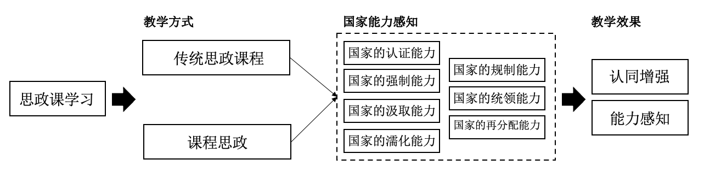]

???

由此，提出本文的两个研究问题


---

## 思政课与国家能力感知

.pull-left[
Regulated .red[Confidence]

> H<sub>1.1</sub>: 公众通过思政课的学习会感知到政府的强制性能力；
]

.pull-right[
.center[]
]

???

关于思政课与国家能力感知，本文的第一个假设是：公众通过思政课的学习会感知到国家的强制性能力

---
## 思政课与国家能力感知

.pull-left[
.center[]
]

.pull-right[

> H<sub>1.2</sub>: 公众通过思政课的学习会感知到政府的非强制性能力；
]

???

第二个假设是：除了强制性能力，公众通过思政课的学习会感知到国家的非强制性能力

---

## 思政课内容和形式

.pull-left[
.center[]
]

.pull-right[

.red[内容]

> H<sub>2.1</sub>: 宣传导向的思政课在提升民众对政府强制性能力感知方面更有效；

> H<sub>2.2</sub>: 实践导向的思政课在民众对政府的非强制性能力感知和通过说服机制提升认同方面更有效；
]

???

对于第二个研究问题，在思政课的内容上，本文将其区分为宣传导向的思政课程和实践导向的课程思政，提出如下第二和第三个假设

---

class: middle


.pull-left[
.red[呈现形式]

> H<sub>2.3</sub>: 多元的教师呈现方式教学效果更好；
]

.pull-right[
.center[Form]
.center[]
]

???

在形式上，本文提出假设多元的教师呈现方式教学效果更好；

---

class: inverse, bottom

# 实证检验
来自调查实验的证据

---

## 数据

.pull-left[
- "高等职业学校在线教育问卷调查"(MoE, 2021)

- 29 省份,97 职业院校, 6030 学生

]


.pull-right[
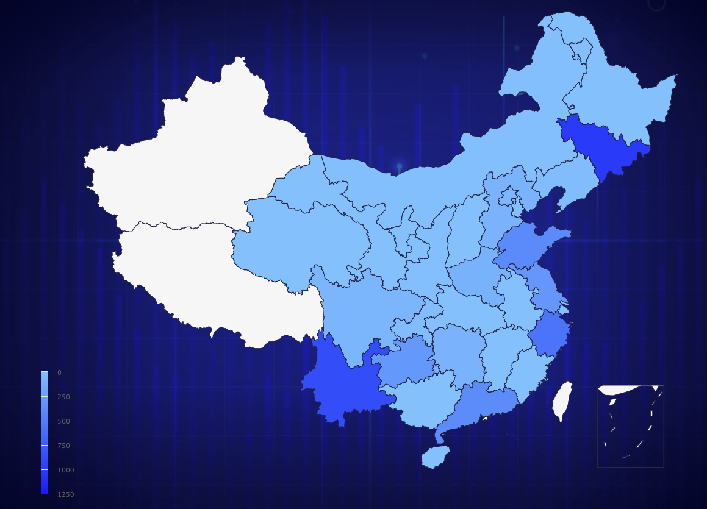
]

???

本文使用的数据来自教育部职业教育中心研究所于2021年6月实施的"高等职业学校在线教育问卷调查",该数据并非来自于具有代表性的随机抽样调查。但调查样本覆盖了全国除港澳台和新疆西藏外的29个省份的97所高等职业学校。总体上与各省份职业教育学生人口规模相匹配，样本总体上较好的呈现了职业教育高校不同年级、专业和程度的差异，具有一定的地区代表性。

---

## 实验设计

.pull-left[

### 干预类别

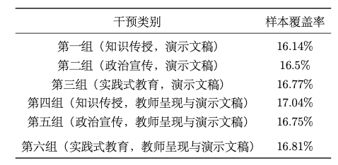

]

.pull-right[

### 模拟干预与实际干预的一致性

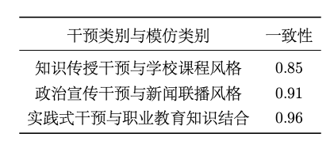

]

???

本研究采用基于调查问卷的析因实验设计，根据思政课的3种内容形式和两种教师呈现方式，生成六种不同的实验干预，通过向不同受访者随机展示六类教学视频作为干预，比较六类干预状态下的教学效果。通过随机化的方式，平均化其他个体间混淆因素的影响，进而能够使用传统的回归分析实现因果效应的推断。


---

## Measurement

### OVs

.pull-left[

- 认同感知

- 能力感知

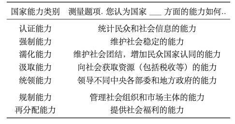


]

### Controls

.pull-right[

- 性别

- 年龄

- 年级

- 政治面貌

- 专业

- 班级规模

- 对所在学校的喜好程度

·······

]

???

我们从认同感知和能力感知两个方面测量了教学效果，尤其详细测量了学生对不同类别的国家能力的感知。

参考现有研究，笔者还控制了性别、年龄、年级、政治面貌、专业、班级规模、对所在学校的喜好程度等受访者的个体特征变量，以准确识别干预效应。


---

class: bottom, inverse

# 实证发现

---

## 公众通过思政课的学习会具体感知到哪些方面的国家能力？

.middle[.center[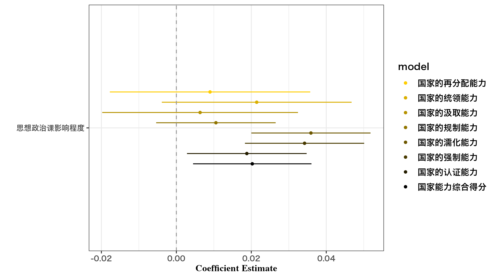]]

???

根据回归分析我们发现，思政课不仅显著提升了受访学生的国家能力综合得分和国家强制能力的感知，还显著增强了与提供公共服务密切相关的国家认证能力和与增加国家认同相关的国家濡化能力感知。

---

## 什么内容和形式的思政课教学效果最好？

.middle[.center[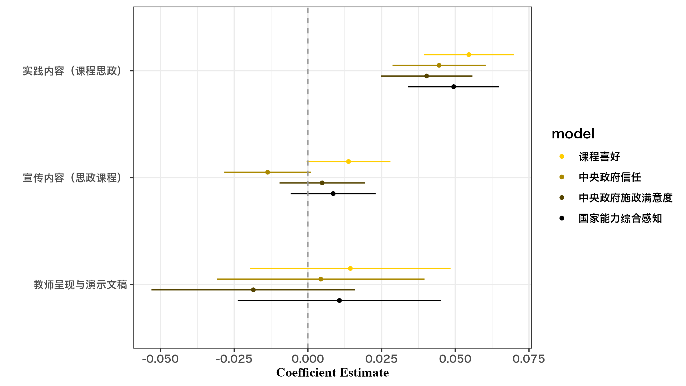]]

???

通过析因实验设计和回归分析，笔者发现思政课的教师呈现方式和宣传内容对四个维度的国家能力感知都没有显著的影响，但和学生专业相结合的实践内容能够显著的从“国家能力感知”、“中央政府施政满意度”、“中央政府信任”和“课程喜好四个维度提升受试学生思想政治课学习的宣传效果。

---

class: bottom, inverse

# 总结与讨论

---

## Discussion

- 硬宣传的软效应

- .red[宣传式教育]的教学效果要好于.navy[教育式宣传]

???

本文通过独特的析因实验设计，发现：

- 以思政课为代表的政治宣传不仅能够使公众感受到国家维护社会稳定的强大能力，从而降低自己的抗争意愿；还能够通过信号理论使公众感受到国家拥有提供公共服务和促进国家认同的软实力，从而通过说服机制，增强对国家的支持，即存在一种“硬宣传的软效应”。

- 课程思政宣传式教育这一的宣传效果要好于教育式宣传的思政课程

---
class: inverse, center, middle


# 蟹蟹 🦀️

[Mails: sunyf20@mails.tsinghua.edu.cn](mailto:sunyf20@mails.tsinghua.edu.cn) 

[Website: syfyufei](https://syfyufei.github.io/)

[Github: github.com/syfyufei](https://github.com/syfyufei)
