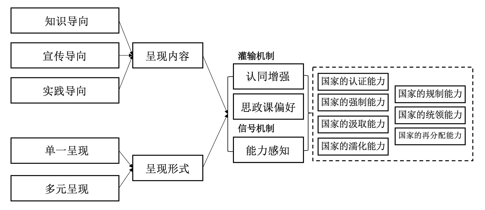
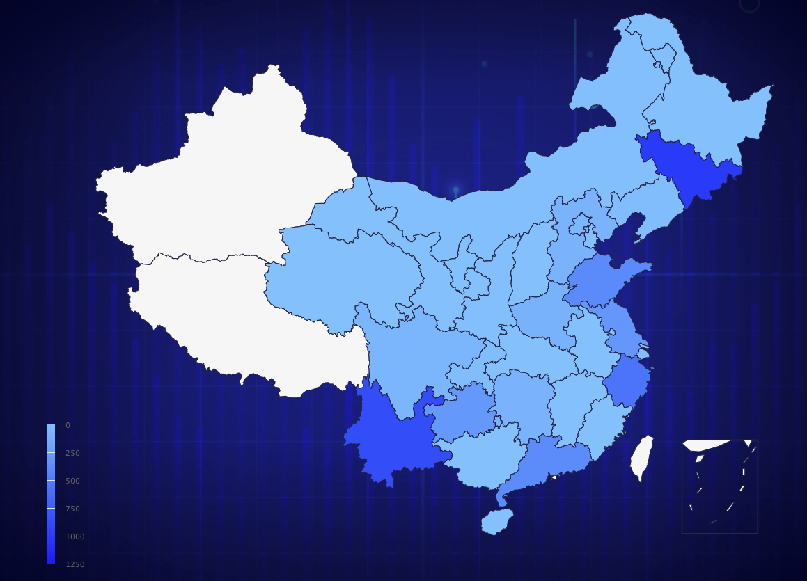
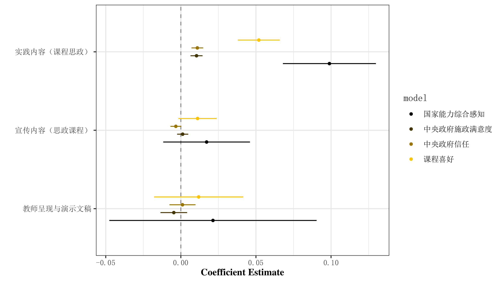

---
output:
  bookdown::pdf_document2:
    keep_tex: true
    fig_caption: true
    latex_engine: xelatex
    number_sections: true
  bookdown::word_document2:
    reference_docx: "template_CHN.docx"
    keep_md: true
    number_sections: FALSE
knit: (function(inputFile, encoding) {rmarkdown::render(inputFile, encoding = encoding, output_format = c("bookdown::word_document2", "bookdown::pdf_document2")) })
documentclass: ctexart

header-includes:
   - \usepackage{makecell}
   
fontsize: 12pt
geometry: margin=1in
bibliography: online_learning.bib
csl: "china-national-standard-gb-t-7714-2015-author-date.csl"
link-citations: true
colorlinks: true
toc: false
indent: true
always_allow_html: true

editor_options: 
  markdown: 
    wrap: sentence

title: '教育式宣传与宣传式教育：远程思政课教师呈现与教学效果的实验研究'
# subtitle: "基于思政课教学的实验研究"

author:
- 孙宇飞^[博士研究生，清华大学政治学系，地址：北京市海淀区清华大学明斋，邮编：100084，电话：18638750921，邮箱：sunyf20@mails.tsinghua.edu.cn]
- 汤霓^[博士，助理研究员，教育部职业技术教育中心研究所，联系电话：15001918603，邮箱：tangni510@163.com]

abstract: |
  政治宣传是政府维持统治合法性和提升公众支持的重要手段之一，现有研究从“灌输机制”和“信号机制”解释政治宣传对公众态度和行为的影响，但少有研究探究两个机制之间的联系。思想政治教育课程是中国政治宣传的重要方式，是落实立德树人根本任务的关键，如何讲好思政课是一个亟待解决的时代命题。本文使用在中国开展在线调查实验获得的独特数据集，结合析因实验设计和回归分析检验了灌输理论的说服机制和信号理论的能力感知之间的关系。笔者发现，以思政课为代表的“硬宣传”在传递威慑信号之外，还具有一种说服的“软效应”。即它不仅能够使公众感受到国家维护社会稳定的强大能力，从而降低自己的抗争意愿；还能够使公众感受到国家拥有提供公共服务和促进国家认同的软实力，从而通过说服机制，增强对国家的支持。笔者提出了一个具有整合性的政治宣传影响框架。在此基础上，笔者基于内容和形式两个视角，从认同增强、能力感知和思政课喜好三个维度探索了影响思政课宣传效果的因素。笔者发现，和学生专业实践相结合的课程内容能够显著的提升受试学生的思想政治课宣传效果，但宣传内容和思政课的教师呈现方式对不同维度的国家能力感知没有显著的影响，即近年来国家倡导的“课程思政”这一“宣传式教育”的教学效果要好于传统的“教育式宣传”类型的“思政课程”。
  
  **关键词**：政治宣传；析因实验；信号机制；国家能力。
---

\newpage

# 引言

\textcolor{red}{远程教育很重要}

政治宣传是维持统治合法性和提升公众支持的的重要手段之一 [@DukalskisGerschewski2017] ，它通过直接影响公民对政府的偏好或信念来影响他们的政治行为 [@HuangCruz2021; @BleckMichelitch2017; @AdenaEtAl2015]。
思想政治教育课程（下文简称“思政课”）是中国政治宣传的重要方式。中国共产党从革命、建设到改革各个历史时期都高度重视思想政治建设，从革命时期的陕北公学到新中国成立后在中学开设"中国革命常识"、"共同纲领"等课程；再到改革开放后，中共先后出台10多个关于学校思想政治工作的文件，对思政课建设提出明确要求，不断推动思政课改革。
思政课作为中国大学生培养的必修环节，是落实立德树人根本任务的关键课程。[@XiJinPing2020]。

\textcolor{red}{课程思政很重要}

在互联网的普及和疫情防控的新形势下，远程教育以其较高的教学灵活性、较低的教育成本、优质资源的共享性等诸多优势成为疫情治理新常态下思政教育的重要支撑。 [@YuanMingZeEtAl2020a] 
远程教育对思政课的在内容、媒介和形式上都提出了新的要求，"思政课不能拿着文件宣读，没有生命、干巴巴的"^[2021年3月6日，中共中央总书记习近平在看望参加全国政协会议的医药卫生界教育界委员时的讲话，请参见：<https://www.chinanews.com/gn/2021/03-30/9443729.shtml>]。
面对新的社会变化和复杂多变的国际形势，习近平总书记提出思想政治教育要"把课堂教学和实践教学有机结合起来"。[@DuShangZe2021]。
尤为重要的是，随着经济的发展和社会的多元化，讲好远程思政课的意义不仅在于学生群体的教育培养，还在于对全体国民的思想价值引领，“学习强国”等软件就发挥着典型示范作用。
由此，如何发挥互联网和远程教育的优势，办好新时代的"大思政课"，是一个亟待解决的时代问题。

基于此，本文旨在使用通过大规模调查实验获得的独特数据集，结合析因实验设计和回归分析等方法，从“呈现内容”和“呈现方式”两个视角，和“认同增强”、“能力感知”和“思政课喜好”三个课程教学效果评价维度出发，提出教师呈现方式对远程思政课教学效果影响的系统性分析框架，并进行实证检验。本研究尝试回答**“如何讲好远程思政课”**这一时代命题。下一部分笔者将回顾现有的相关研究，在此基础上提出本文的研究假设，第三部分提出了本文的实验设计和数据来源，第4部分报告了本研究的实证结果，最后一部分讨论了我们的结果并得出了本文的结论。下图报告了本文的分析框架。

{width=100%}

# 文献综述与研究假设

## 教师呈现：对学习者的影响

在互联网的普及和疫情防控的新形势下，远程教育以其较高的教学灵活性、较低的教育成本、优质资源的共享性等诸多优势成为疫情治理新常态下思政教育的重要支撑。 [@YuanMingZeEtAl2020a] 但与此同时，远程教育学生自主性不足、保持率不高、交流互动不足等固有问题也日益突出。 [@WangJiDeEtAl2014 ] 其中，作为讲好远程思想政治课的"关键"，如何在教学过程中发挥教师的积极性、主动性、创造性[@XiJinPing2020]，即远程思政课教学中的教师呈现问题是本研究主要关注的核心。

教师呈现有广义和狭义之分，狭义的教师呈现专指在教学过程中，教师干预课程教学的不同形式，包括文字、音频、视频、互动等多种方式，教师呈现已经在现有在线教育产业中得到充分应用。^[@YangJiuMinEtAl2015 选取来自Coursera、Udacity、edX,以及"清华学堂在线"、"央视网中国公开课"、"新浪公开课"、"中国大学MOOC"等国内外主流在线教育平台,发现94.5%的教学视频都呈现了教师形象,仅有5.5%的视频完全没有教师呈现。]在在线教育领域，现有的教师呈现主要包括教师融合式、教师嵌入式和课堂实录式三种方式。[@YuanMingZeEtAl2020a]
广义的教师呈现不仅包括教师干预教学的形式，还包括教师的教学内容。本文关注的教师呈现方式是广义的教师呈现，贯穿教师教学的整个过程。

在教师呈现对学习者学习效果的影响上，现有研究主要包括社会临场感、认知负荷、注意和学习者偏好等视角 [@YuanMingZeEtAl2020a]。持 社会临场感视角的学者认为，教师利用多种方式与在线教育深度融合，能够营造出一种类似真实课堂的学习氛围，从而提升学生的社会临场感，进而有效促进学习效果的提升。[@DunsworthAtkinson2007]；持认知负荷视角的学者提出了不同的意见，他们认为教师呈现会造成学生学习的信息冗余，从而影响学习效果。 [@Sweller1994] 还有学者从注意视角出发，认为有丰富呈现的课程，能够通过不断变换教师呈现，来吸引学生的注意力。[@Kleinke1986] 还有学者认为，教师呈现对学习者学习的影响存在个体性差异，会影响学生对一门课程的喜爱。[@KizilcecEtAl2014] 需要注意的是，学习者偏好的视角是学习者对于在线课程的感受，但与学习效果并不存在必然联系。[@YuanMingZeEtAl2020a]

现有研究从多方面探讨了在教师呈现对学习者的影响，但是少有学者研究这一影响在不同类型课程中的异质性。笔者认为，教师呈现对于学习者的影响在不同类型的课程上存在较大的不同。对于理解型的课程来说，多样的教师呈现形式能够提升学生的兴趣和注意力，从而提升学生的学习效果。但是对于诸如思想政治课这类注重记忆和宣传的"硬教育"，教师呈现形式对学习者的学习效果没有显著的影响，教学效果的多寡关键在于教师呈现的内容。

## 政治宣传的公众影响：灌输机制与信号机制

政治宣传是指为了某一个特定的政治目标、政党或个人而进行的信息传播。[@ArceneauxTruex2020] 现有政治宣传对于公众影响的研究主要包括灌输机制与信号机制，它们从个人和集体两个层面出发，通过不同的进路对公众的观点和行为产生影响。

灌输机制是指政府利用行政优势，通过媒体和教育等向社会发布对自己有利的知识或新闻，试图传递社会和政治价值，并说服民众相信上述信息，从而增加公众对自己的信任和支持 [@JowettODonnell2018]。在宣传如何该改变人们的态度这一问题上，持灌输机制的学者主要从有意识的说服和潜意识的说服两个维度提供证据。对 于宣传说服力的早期研究集中在人们通过宣传有意识的持有政治观点这一角度，主要存在说服和学习两种方式。@Chaffee2021 等学者认为提供关于某一问题的信息会改变人们对该问题的看法和态度。灌 输机制也被证明通过学习，即提供新颖的信息并形成新的观点这一方式起作用。[@PriorLupia2008] 然而明显的信念很难被改变。另一方面的研究发现，政治信息的宣传灌输也可以通过简单的改变受众的注意力而非观点来改变态度 [@ChongDruckman2007]。
潜意识是灌输机制影响的另一进路，@ChongDruckman2007 进一步指出，个人需要有足够的动机来有意识的思考，但宣传可以在不进行深思熟虑的情况下影响受众的态度，@ArceneauxTruex2020 就通过内隐联想实验给这一强调潜意识改变态度的论点提供了实证证据，他们发现宣传能够通过潜移默化的方式不知不觉地说服民众。

但是灌输机制近年来也受到一些研究者的批评，@Huang2015a 等学者认为，灌输机制有效的前提是人们被宣传的内容说服，即没有说服力或明显虚假的宣传是无法通过灌输机制影响民众的。但是他们发现诸如前苏联的政治口号 [@HavelWilson1985] 和叙利亚的夸张论述 [@Wedeen1998]等宣传机制仍然在非西方选举民主式国家广泛存在，而且当局愿意为之付出相当昂贵的成本。

信号机制是在反思灌输机制的基础上产生的，它是对灌输理论的补充而非替代。[@Huang2015a]如果态度的改变只能通过有意识的深思熟虑产生，那么强硬的宣传就不太可能改变很多人的想法 [@ArceneauxTruex2020]。学者们很早就注意到，政治宣传往往不是为了说服 [@Arendt2007]， @Huang2015a 用博弈论模型和问卷调查提出了政治宣传的信号机制，即即使民众不喜欢、不相信政治宣传，但政府依然能够花费大量成本使这些宣传存在，而且迫使民众接受宣传，这会使民众感受到国家的实力和能力，重新计算自己的反抗成本，从而减少对政府的提出反对的意识和行动。换句话说，宣传不是塑造个人的政治偏好，而是通过影响他们对国家能力的感知来发挥作用。[@Huang2018; @HuangCruz2021]

\textcolor{red}{思政课程：中国政治宣传的积极探索}

## 研究问题与研究假设

现有研究为我们进一步探索教师呈现方式对于远程思政课的教学效果的影响机制提供了坚实的基础，但仍存在一定的学术推进空间。
教师呈现对学习者的影响在不同类型课程中的是否具有异质性？教师呈现的内容和形式对于课程教学效果的影响是否也具有差异？
作为一种政治宣传形式的思政课，知识导向的思政课教学、宣传导向的“思政课程”和中国政府近来推广的实践型导向的“课程思政”[@DuShangZe2021]哪种方式的教学效果和宣传效果更好？这些都是本文亟待回答的问题。

具体来说，本文关注以下研究问题：

**研究问题1:** 在远程思政课教学过程中，哪种教师呈现内容能够获得更好的教学效果？

**研究问题2:** 在远程思政课教学过程中，哪种教师呈现形式能够获得更好的教学效果？

基于现有文献的讨论，笔者提出以下研究假设：

**研究假设1:** 不同的教师呈现形式对思想政治课的学习效果没有影响；

**研究假设2:** 实践型导向的“课程思政”在“认同增强”、“能力感知”和“思政课喜好”三个课程教学效果评价维度上都有更好的课程教学效果。

# 数据、变量和方法

## 数据来源

本文使用的数据来自教育部职业教育中心研究所于2021年6月通过网络调查平台实施的"高等职业学校在线教育问卷调查"，该调查旨在了解2021年新型冠状病毒防控新常态下"高等职业学校学生的在线学习情况。该调查采集了6090位职业高校在读学生的数据，经过删除作答时间较短的问卷，最终获得6030份有效样本。由于调查成本和条件的限制，该数据并非来自于具有代表性的随机抽样调查。但调查样本覆盖了全国除港澳台和新疆西藏外的29个省份的97所高等职业学校。样本的地域分布如图2所示，总体上与各省份职业教育学生人口规模相匹配，样本总体上较好的呈现了职业教育高校不同年级、专业和程度的差异，具有较好的地区代表性。

{width=90%}

## 实验设计

本文采用基于调查问卷的析因实验设计，通过向不同受访者展示六类不同的思想政治课的教学视频作为干预，比较六类干预状态下学生在认同感知、能力感知和思政课喜好三个维度的干预效应，从而检验思想政治课的宣传效果及其影响因素。本研究通过在网络调查问卷中施加随机干预，从而平均化其他个体间混淆因素的影响，进而能够使用传统的回归分析实现因果效应的推断。[@EgamiImai2018]

具体而言，笔者选择"十八大以来的历史性成就"这一现实存在的课程设计^["十八大以来的历史性成就"是中国高校学生必修的思想政治课《形势与政策》中的必修环节，在官方录制的各种教育视频中也广泛出现，详细请参见：<http://dangshi.people.com.cn/n1/2021/0524/c436975-32111354.html>。]，向受访者提供六种不同内容和形式的思想政治课干预，再观察所提供的不同课程对受访者政治宣传效果的影响。
笔者将教师呈现的内容分为"知识传授"、"政治宣传"和"实践式教育"三种类型。"知识传授"即教育式宣传，笔者将"十八大以来的历史性成就"中涉及的知识点明确点出，并用清晰和结构化的形式展现给受访学生。它侧重的影响视角是灌输机制，即通过学习和说服来改变公众的态度和行为；"政治宣传"即宣传式教育，笔者基于"中国共产党党史学习教育领导小组办公室"指导录制的"国史讲堂"系列理论视频之"党史微课"系列中的"十八大以来的历史性成就体现在哪些方面"的视频为基础，修改后展现给受访学生。它侧重的影响视角是信号机制，即通过能力感知来影响公众；"实践式教育"即"课程思政"，是根据中国政府今年倡导的"讲好大思政课"，将思想政治宣传融入进实践知识和专业知识的学习中的实施意见和指导纲要而设计。^[具实施意见和指导纲要请参见：中共中央办公厅、国务院办公厅《关于深化新时代学校思想政治理论课改革创新的若干意见》、《高等学校课程思政建设指导纲要》等文件。]由于受访的学生来自于不同的专业背景，笔者将思政课和受访学生的共同特征------职业教育相结合，从而模仿"实践式教育"即"课程思政"对受访进行干预。为了避免笔者模仿的干预和真实干预存在的偏差对实验结果造成影响，笔者在实施刺激后向不同干预组的受访学生分别询问："该视频是否与学校课程风格/新闻联播风格/职业教育知识类似"的问题。笔者发现，实验干预的不同组别和上述问题的回答均有较高的一致性，具体一致性数据请参见表1。

<table class="table" style="margin-left: auto; margin-right: auto;">
<caption>Table 1: 实验干预与被试感知一致性程度</caption>
 <thead>
  <tr>
   <th style="text-align:center;"> 干预类别与模仿类别 </th>
   <th style="text-align:center;"> 一致性 </th>
  </tr>
 </thead>
<tbody>
  <tr>
   <td style="text-align:center;"> 知识传授干预与学校课程风格 </td>
   <td style="text-align:center;"> 0.85 </td>
  </tr>
  <tr>
   <td style="text-align:center;"> 政治宣传干预与新闻联播风格 </td>
   <td style="text-align:center;"> 0.91 </td>
  </tr>
  <tr>
   <td style="text-align:center;"> 实践式干预与职业教育知识结合 </td>
   <td style="text-align:center;"> 0.96 </td>
  </tr>
</tbody>
</table>

笔者将远程思政课的教师呈现方式分为"单一呈现"和"多元呈现"两种形式，"单一呈现"方式指在远程思政课堂中，教师只使用演示文稿进行语音讲解；"多元呈现"是指教师借助视频、语音、手势和演示文稿等多种方式进行远程思想政治课的教学。由此笔者将远程思政课教师呈现的内容和方式交叉共形成六种干预状态，笔者借助在线调查工具的随机分组功能将受访学生随机分成六组，分别在给定的不同情景下回答问卷问题，从而实现在是无法提前确定受访对象情况的前提下保证了实验干预的随机性。具体而言，首先，笔者对所有受访人展示下列引导语：

*"请认真观看下列思想政治课视频，观看后，请您回答相应问题"*

接下来，通过六种情景视频干预对受访者施加刺激，六种干预视频的名称和样本覆盖率见表2所示。

<table class="table" style="margin-left: auto; margin-right: auto;">
<caption>Table 2: 思想政治课的六种干预状态</caption>
 <thead>
  <tr>
   <th style="text-align:center;"> 干预类别 </th>
   <th style="text-align:center;"> 样本覆盖率 </th>
  </tr>
 </thead>
<tbody>
  <tr>
   <td style="text-align:center;"> 第一组（知识传授，演示文稿） </td>
   <td style="text-align:center;"> 16.14% </td>
  </tr>
  <tr>
   <td style="text-align:center;"> 第二组（政治宣传，演示文稿） </td>
   <td style="text-align:center;"> 16.5% </td>
  </tr>
  <tr>
   <td style="text-align:center;"> 第三组（实践式教育，演示文稿） </td>
   <td style="text-align:center;"> 16.77% </td>
  </tr>
  <tr>
   <td style="text-align:center;"> 第四组（知识传授，教师呈现与演示文稿） </td>
   <td style="text-align:center;"> 17.04% </td>
  </tr>
  <tr>
   <td style="text-align:center;"> 第五组（政治宣传，教师呈现与演示文稿） </td>
   <td style="text-align:center;"> 16.75% </td>
  </tr>
  <tr>
   <td style="text-align:center;"> 第六组（实践式教育，教师呈现与演示文稿） </td>
   <td style="text-align:center;"> 16.81% </td>
  </tr>
</tbody>
</table>

## 因变量

在因变量的测量上，笔者在呈现干预情景后从认同感知、能力感知和思政课喜好三个影响维度系统测量了一系列反应思政课教学效果的因素。在认同感知方面，笔者测量了受访学生对中央政府施政的满意程度和信任程度；在能力感知方面，笔者根据 @WangShaoGuang2008 提出的国家能力分类对受访学生受到不同类型思想政治课干预后的七类国家能力感知进行测量，具体测量题项见下表所示；在此基础上，笔者还询问了各干预组的受访学生对于实验干预思想政治课的喜好程度。

<table class="table" style="margin-left: auto; margin-right: auto;">
<caption>Table 3: 七类国家能力感知的测量</caption>
 <thead>
  <tr>
   <th style="text-align:center;"> 国家能力类别 </th>
   <th style="text-align:center;"> 测量题项.您认为国家__方面的能力如何.. </th>
  </tr>
 </thead>
<tbody>
  <tr>
   <td style="text-align:center;"> 认证能力 </td>
   <td style="text-align:center;"> 统计民众和社会信息的能力 </td>
  </tr>
  <tr>
   <td style="text-align:center;"> 强制能力 </td>
   <td style="text-align:center;"> 维护社会稳定的能力 </td>
  </tr>
  <tr>
   <td style="text-align:center;"> 濡化能力 </td>
   <td style="text-align:center;"> 维护社会团结，增加民众国家认同的能力 </td>
  </tr>
  <tr>
   <td style="text-align:center;"> 汲取能力 </td>
   <td style="text-align:center;"> 向社会获取资源（包括税收等）的能力 </td>
  </tr>
  <tr>
   <td style="text-align:center;"> 统领能力 </td>
   <td style="text-align:center;"> 领导不同中央各部委和地方政府的能力 </td>
  </tr>
  <tr>
   <td style="text-align:center;"> 规制能力 </td>
   <td style="text-align:center;"> 管理社会组织和市场主体的能力 </td>
  </tr>
  <tr>
   <td style="text-align:center;"> 再分配能力 </td>
   <td style="text-align:center;"> 提供社会福利的能力 </td>
  </tr>
</tbody>
</table>

## 控制变量

不同干预通过随机分配，且经过平衡性检验，除干预之外的其他变量（如人口学和社会经济特征等）在各个分组之间没有显著的差异。但参考现有研究，笔者还控制了性别、年龄、年级、政治面貌、专业、班级规模、对所在学校的喜好程度等受访者的个体特征变量，以准确识别干预效应。

# 研究发现：教师呈现对远程思政课教学效果的影响

为了测量教师呈现的内容和方式对远程思政课教学效果的影响，笔者在对受访学生施加六种不同的刺激后，分别从认同感知、能力感知和思政课喜好三个影响维度测量了思政课的宣传效果。并借助析因实验设计和回归分析，检验三种思政课内容和两种教师呈现方式对思政课教学效果的影响。

{width=100%}

通过析因实验设计和回归分析，笔者分别以“知识导向”的呈现内容和“单一形式”的呈现方式为远程思政课教师呈现内容和呈现形式的参照组。笔者发现，在远程思政课的教学过程中，对于教师呈现的方式，和已有对一般知识型教育的研究不同，思想政治教育的教学效果对教师呈现的方式并不敏感。多元的教师呈现方式和单一的教师呈现方式对于“认同增强”、“能力感知”和“思政课喜好”三个维度教学效果的均不显著。

对于教师呈现的内容，传统机遇宣传导向的“思政课程”对四个维度的国家能力感知都没有显著的影响，但是和学生专业相结合的实践导向课程即“课程思政”能够显著的从“国家能力感知”、“中央政府施政满意度”、“中央政府信任”和“思政课喜好”等维度提升受试学生远程思想政治课的学习效果。

# 思考和讨论

本文使用通过大规模调查实验获得的独特数据集，结合析因实验设计和回归分析等方法，从“呈现内容”和“呈现方式”两个视角，和“认同增强”、“能力感知”和“思政课喜好”三个课程教学效果评价维度出发，探索了教师呈现内容和方式对远程思政课教学效果的影响，提出了教师呈现方式对远程思政课教学效果影响的系统性分析框架，并进行了实证检验。本研究对**“如何讲好远程思政课”**这一时代命题进行了较为全面地回答。

结合析因实验和回归分析，笔者发现，对于远程思政课的教师呈现的方式，多元呈现和单一呈现在教学效果上并无差异。在教师呈现的内容上，和传统的“思政课程”相比，和学生专业相结合的实践导向课程即“课程思政”能够更好地让学生喜欢思政课、感受到国家能力的存在，以及提升国家认同和政府信任。

\newpage

# 参考文献 {.unnumbered}

::: {#refs}
:::

\break

# (APPENDIX) Supplementary Materials {.unnumbered}

## 调查问卷

笔者使用问卷星平台进行随机干预，使用清华大学问卷平台进行干预效果的测量。本文调查问卷的详细内容请参见：

[调查问卷第一部分](https://civtemoe.wjx.cn/vj/wdJmKjm.aspx)

[调查问卷第二部分](http://wenjuan.tsinghua.edu.cn/s/vem6Jj/)
