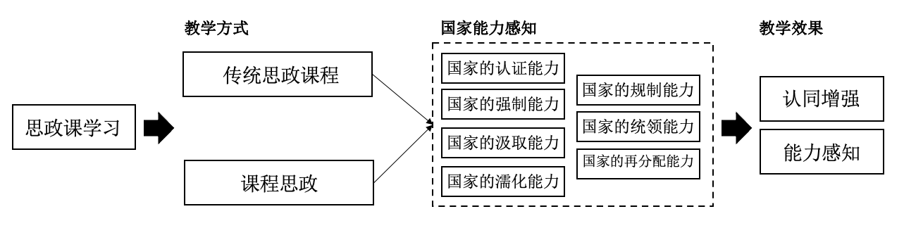
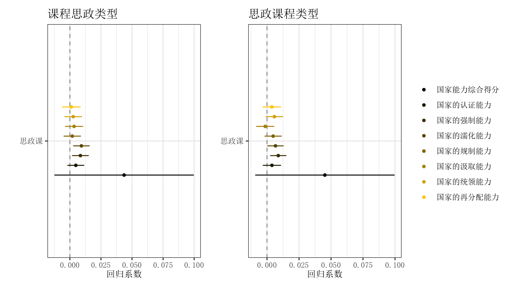

---
output:
  bookdown::pdf_document2:
    keep_tex: true
    fig_caption: true
    latex_engine: xelatex
    number_sections: true
  bookdown::word_document2:
    reference_docx: "template_CHN.docx"
    keep_md: true
    number_sections: FALSE
knit: (function(inputFile, encoding) {rmarkdown::render(inputFile, encoding = encoding, output_format = c("bookdown::word_document2", "bookdown::pdf_document2")) })
documentclass: ctexart

header-includes:
   - \usepackage{makecell}
   
fontsize: 12pt
geometry: margin=1in
bibliography: online_learning.bib
csl: "china-national-standard-gb-t-7714-2015-author-date.csl"
link-citations: true
colorlinks: true
toc: false
indent: true
always_allow_html: true

editor_options: 
  markdown: 
    wrap: sentence

title: '信号机制的说服作用：“课程思政”与国家能力感知'
subtitle: "基于职业教育院校学生思政课教学效果的随机实验"

author:
- 孙宇飞^[清华大学政治学系博士生，联系电话：18638750921，邮箱：sunyf20@mails.tsinghua.edu.cn]
- 刘泓暄^[北京航空航天大学人文与社会科学高等研究院，邮箱：liuhx2020@buaa.edu.cn，本文通讯作者。本文正在投稿中，相关版本记录已上传至版本管理平台备份，请勿传播本文]

abstract: |
  思想政治理论课是落实立德树人根本任务的关键课程，是培养职业教育高水平人才的重要内容。如何讲好思政课，是亟待解决的时代命题。近年来，中宣部、宣传部等国家多个部门大力加强职业院校“课程思政”建设，将“课程思政”融入职业技术教育课堂教学建设。明确职业技术高校“课程思政”教学模式的作用机制，是将“课程思政”融入课堂教学建设全过程，发挥“课程思政”教学模式的作用机制在思想政治教育上突出优势的前提和基础。笔者使用在中国开展在线调查实验获得的独特数据集，基于政治学和教育学的理论视角，从思想政治教育的“信号机制”和“说服机制”两个角度出发，从“信号机制的说服作用”的角度，探究了以思政课为代表的思想政治教育与国家能力感知的关系。本文进一步明确灌输理论的说服机制和信号理论的能力感知之间的联系，提出了一个具有整合性的思想政治教育影响框架，并在此基础上明确职业技术高校“课程思政”教学模式的作用机制，进一步论证了“课程思政”的思想政治教育效果。本文结合随机实验和回归分析发现，和传统思想政治课程相比，“课程思政”这种将课程思政融入课堂教学建设全过程的思想政治教育方式，不仅能够显著提高受试学生的“国家强制能力感知”，还能够显著提升他们对“国家濡化能力”的感知，即“课程思政”这种教学形式的思想政治教育效果要好于教育式宣传的思政课程不仅能够通过提升学生对“强制力信号”感知来实现思想政治教育，还能够通过信号理论使公众感受到国家拥有促进国家认同的软实力，从而通过说服机制，增强对国家的支持，即存在一种“信号机制的说服作用”。
  
  **关键词**：课程思政；国家能力；信号机制；随机试验。
---

\newpage

# 引言

思想政治理论课是落实立德树人根本任务的关键课程，是形成高水平人才培养体系的重要内容。[@XiJinPing2020]但是"思政课不能拿着文件宣读，没有生命、干巴巴的"[^1]，如何讲好思政课，成为了亟待解决的时代命题。习近平总书记提出"思政课建设要向改革创新要活力，把课堂教学和实践教学有机结合起来"的新要求，给新时代开展思想政治教育工作点名了前进的方向。中宣部、教育部等部门也多次强调要思想政治教育要和实践结合，强调职业院校的思想政治课程“要体现职业教育特色”[@ZhongGongZhongYangXuanChuanBuJiaoYuBu2020]，更明确提出要把思想政治教育贯穿人才培养体系，全面推进高校课程思政建设[@ZhongHuaRenMinGongHeGuoJiaoYuBu2020]。大力加强课程思政建设，将课程思政融入职业技术教育课堂教学建设是全面提高职业教育人才培养质量的重要任务，是当前职业技术院校德育工作的重中之重。

明确职业技术高校“课程思政”教学模式的作用机制，搞清楚“课程思政为什么行”，是将课程思政融入课堂教学建设全过程，发挥“课程思政”教学模式的作用机制在思想政治教育上突出优势的前提和基础。基于此，本文就旨在使用在中国开展在线调查实验获得的独特数据集，基于政治学和教育学的理论视角，从思想政治教育的“信号机制”和“说服机制”两个角度出发，借助随机试验和回归分析，提出了一个具有整合性的影响框架，从“信号机制的说服作用”的角度，进一步论证了“课程思政”的思想政治教育效果。下一部分笔者回顾了思想政治教育尤其是“课程思政”领域现有的研究，在此基础上提出本文的研究假设，第3部分报告了本文的实验设计和数据来源，第4部分报告了本研究的实证结果，最后一部分讨论了我们的结果并得出了本文的结论。下图 @\ref(fig:frame)报告了本文的分析框架。

[^1]: 2021年3月6日，中共中央总书记习近平在看望参加全国政协会议的医药卫生界教育界委员时的讲话，请参见：<https://www.chinanews.com/gn/2021/03-30/9443729.shtml>

{width=100%}

# 文献综述与研究假设

## 思想政治理论课的教学效果：说服机制与信号机制

思政课是培养一代又一代社会主义建设者和接班人的重要保障，思政课作用不可替代[@XiJinPing2019]。现有关于思想政治教育对于公众影响的研究主要包括说服机制与信号机制。

说服机制是指政府通过开展政治思想理论教育，向社会传递政治价值，并通过说服的方式提升民众的思想认同，从而增加公众对自己的信任和支持 [@JowettODonnell2018]在思想政治教育如何该改变人们的态度这一问题上，持说服机制的学者主要从有意识的说服和潜意识的说服两个维度提供证据。对于宣传说服力的早期研究集中在人们通过宣传有意识的持有政治观点这一角度，主要存在说服和学习两种方式。@Chaffee2021 等学者认为提供关于某一问题的信息会改变人们对该问题的看法和态度。说服机制也被证明通过学习，即提供新颖的信息并形成新的观点这一方式起作用。[@PriorLupia2008] 然而明显的信念很难被改变。另一方面的研究发现，思想政治课的说服机制也可以通过简单的改变受众的注意力而非观点来改变态度 [@ChongDruckman2007]。潜意识是说服机制影响的另一进路，@ChongDruckman2007 进一步指出，个人需要有足够的动机来有意识的思考，但宣传可以在不进行深思熟虑的情况下影响受众的态度，@ArceneauxTruex2020 就通过内隐联想实验给这一强调潜意识改变态度的论点提供了实证证据，他们发现类似思想政治课的思想政治教育能够通过潜移默化的方式不知不觉地说服民众。

近年来，信号机制被另一进路的学者广泛关注。信号机制是在反思灌输机制的基础上产生的，它是对灌输理论的补充而非替代。[@Huang2015a]如果态度的改变只能通过有意识的深思熟虑产生，那么生硬的思想政治教育就不太可能改变很多人的想法 [@ArceneauxTruex2020]。学者们很早就注意到，思想政治教育往往不是为了说服 [@Arendt2007]， @Huang2015a 用博弈论模型和问卷调查提出了思想政治课的信号机制，即通过思想政治教育会使民众感受到国家的实力和能力，从而重新计算自己的越轨成本，由此提升对国家的支持。换句话说，宣传不是塑造个人的政治偏好，而是通过影响他们对国家能力的感知来发挥作用。[@Huang2018]
 

文献综述增加两部分内容（刘泓暄补充）：

1.职业教育思想政治教育的研究综述（1000字）

2.课程思政的研究综述（1000字）

## 研究问题与研究假设

现有研究为我们进一步探索思想政治课的影响机制提供了坚实的基础，但仍存在一定的学术推进空间。信号机制看似是对说服机制的补充，但是信号机制的"信号"本身却是模糊的，它让公众感受到国家掌握"大量资源的能力和向社会强加宣传"的能力[@Huang2015a]，但并没有详细讨论公众感受到的具体是一种什么样的国家能力。除了 @Huang2015a 在调查中提出的强制性能力外，民众是否还会在思想政治教育中感受到其他方面的国家能力，尤其是和国家提供公共服务或增强国家认同相关的等非强制性能力，从而提升对政府的支持和信任。与此同时，如果这一机制有效，那是否能作为灌输机制的一种特殊模式，从而将说服机制和信息机制整合起来，用一种整合性的框架来理解思想政治课对民众的影响。进一步值得探讨的是，“课程思政”这种将课程思政融入课堂教学建设全过程的思想政治课教学方式是如何实现立德树人的作用的，和传统方式相比这一影响为何更有优势？

本文就旨在使用在中国开展在线调查实验获得的独特数据集，从说服机制和信号机制两方面出发，比较了“课程思政”和传统思政课程的教学效果，考察了“课程思政”对学生的影响机制。具体来说，本文关注以下研究问题：

**研究问题1:** 公众通过思想政治课的学习会具体感知到哪些方面的国家能力？

基于现有文献的讨论，笔者提出以下研究假设：

**研究假设1.1:** 公众通过思想政治课的学习会感知到政府的强制性能力；

**研究假设1.2:** 公众通过思想政治课的学习会感知到政府的非强制性能力；

# 数据、变量和方法

## 数据来源

本文使用的数据来自教育部职业教育中心研究所于2021年6月通过网络调查平台实施的"高等职业学校思想政治教育问卷调查"，该调查旨在了解2021年新型冠状病毒防控新常态下"高等职业学校学生的思想政治课程的学习情况。该调查采集了6090位职业高校在读学生的数据，经过删除作答时间较短的问卷，最终获得6030份有效样本。由于调查成本和条件的限制，该数据并非来自于具有代表性的随机抽样调查。但调查样本覆盖了全国除港澳台和新疆西藏外的29个省份的97所高等职业学校。总体上与各省份职业教育学生人口规模相匹配，样本总体上较好的呈现了职业教育高校不同年级、专业和程度的差异，具有较好的地区代表性。

## 实验设计

本研究首先将受访者随机分成两组，通过向不同组别的受访者分别展示“课程思政”教学内容和“思政课程”教学内容的思想政治课教学影片，在干预后观察所提供的不同课程内容对受访者思想政治效果的影响，两种干预视频的名称和样本覆盖率见表@\ref(tab:)所示。[^5]。

<table class="table" style="margin-left: auto; margin-right: auto;">
<caption>Table 1: 思想政治课的两种干预状态</caption>
 <thead>
  <tr>
   <th style="text-align:center;"> 干预类别 </th>
   <th style="text-align:center;"> 样本覆盖率 </th>
  </tr>
 </thead>
<tbody>
  <tr>
   <td style="text-align:center;"> 第一组（课程思政） </td>
   <td style="text-align:center;"> 50.14% </td>
  </tr>
  <tr>
   <td style="text-align:center;"> 第二组（传统思政课程） </td>
   <td style="text-align:center;"> 49.86% </td>
  </tr>
</tbody>
</table>

具体而言，笔者选择"十八大以来的历史性成就"这一现实存在的课程设计[^3]，向受访者提供两种不同内容的思想政治课干预，再观察所提供的不同课程内容对受访者思想政治效果的影响。对于思想政治课的教学效果，我们不将正答率作为测量指标，因为思想政治课的目的更多的在于提升学生的国家认同和支持而非知识学习。笔者通过测量他们对上述课程知识点的正答率来计算他们受到思想政治课教学的影响。在完成测量后，笔者通过问卷询问了他们在国家能力感知的不同维度的差异，由此推断他们的思政政治课程学习效果。

[^3]: "十八大以来的历史性成就"是中国高校学生必修的思想政治课《形势与政策》中的必修环节，在官方录制的各种教育视频中也广泛出现，详细请参见：<http://dangshi.people.com.cn/n1/2021/0524/c436975-32111354.html>。

## 因变量

在因变量的测量上，笔者在呈现干预情景后从认同感知、能力感知和思政课喜好三个影响维度系统测量了一系列反应思政课教学效果的因素。在认同感知方面，笔者测量了受访学生对中央政府施政的满意程度和信任程度；在能力感知方面，笔者根据 @WangShaoGuang2008 提出的国家能力分类对受访学生受到不同类型思想政治课干预后的七类国家能力感知进行测量，具体测量题项见下表所示；在此基础上，笔者还询问了各干预组的受访学生对刚刚受到的思想政治课的喜好程度。

<table class="table" style="margin-left: auto; margin-right: auto;">
<caption>Table 2: 七类国家能力感知的测量</caption>
 <thead>
  <tr>
   <th style="text-align:center;"> 国家能力类别 </th>
   <th style="text-align:center;"> 测量题项.您认为国家__方面的能力如何.. </th>
  </tr>
 </thead>
<tbody>
  <tr>
   <td style="text-align:center;"> 认证能力 </td>
   <td style="text-align:center;"> 统计民众和社会信息的能力 </td>
  </tr>
  <tr>
   <td style="text-align:center;"> 强制能力 </td>
   <td style="text-align:center;"> 维护社会稳定的能力 </td>
  </tr>
  <tr>
   <td style="text-align:center;"> 濡化能力 </td>
   <td style="text-align:center;"> 维护社会团结，增加民众国家认同的能力 </td>
  </tr>
  <tr>
   <td style="text-align:center;"> 汲取能力 </td>
   <td style="text-align:center;"> 向社会获取资源（包括税收等）的能力 </td>
  </tr>
  <tr>
   <td style="text-align:center;"> 统领能力 </td>
   <td style="text-align:center;"> 领导不同中央各部委和地方政府的能力 </td>
  </tr>
  <tr>
   <td style="text-align:center;"> 规制能力 </td>
   <td style="text-align:center;"> 管理社会组织和市场主体的能力 </td>
  </tr>
  <tr>
   <td style="text-align:center;"> 再分配能力 </td>
   <td style="text-align:center;"> 提供社会福利的能力 </td>
  </tr>
</tbody>
</table>

## 控制变量

不同干预通过随机分配，且经过平衡性检验，除干预之外的其他变量（如人口学和社会经济特征等）在两个分组之间没有显著的差异。但参考现有研究，笔者还控制了性别、年龄、年级、政治面貌、专业、班级规模、对所在学校的喜好程度等受访者的个体特征变量，以准确识别干预效应。

# 研究发现

## 思想政治教育和国家能力感知

虽然所有学生都受到了干预视频的刺激，但是学生对于这些课程的关注和掌握程度存在差异，因此这些课程对学生的影响程度也不同。 [@Huang2015a]笔者在受访学生观看过思想政治课视频后，使用五道测试题的正答率来衡量学生受到干预视频的影响程度，再对所有学生的各类国家能力感知进行测量。笔者借助回归分析检验了学生受到思想政治教育的影响程度对学生各类国家能力感知的影响。“综合国家能力得分”是笔者借助主成分分析提取的衡量学生综合国家能力感知的变量，所有回归模型均控制了干预组之间的影响。回归结果如下图所示。

{width=100%}

根据回归分析我们发现，不同的思想政治课刺激均在一定程度上改变的受访者的国家能力感知，但又存在不同。具体来说，受到两类思想政治课程刺激受访者对国家强制能力的感知都显著提升了，即他们都受到了“信号机制”的中“强制力信号”的影响。但是在“国家的濡化能力”感知方面，受到传统思政课程类型刺激的受访者的改变并不显著，但是受到课程思政的受访者的国家濡化能力感知有显著的提升。即“课程思政”这种教学形式不仅能够通过提升学生对“强制力信号”感知来实现思想政治教育，还能够通过信号理论使公众感受到国家拥有促进国家认同的软实力，从而通过说服机制，增强对国家的支持，即存在一种“信号机制的说服作用”。

# 思考和讨论

笔者使用在中国开展在线调查实验获得的独特数据集，基于政治学和教育学的理论视角，从思想政治教育的“信号机制”和“说服机制”两个角度出发，借助随机试验和回归分析，从“信号机制的说服作用”的角度，探究了以思政课为代表的思想政治教育与国家能力感知的关系。本文进一步明确灌输理论的说服机制和信号理论的能力感知之间的联系，提出了一个具有整合性的思想政治教育影响框架，并在此基础上明确职业技术高校“课程思政”教学模式的作用机制，搞清楚“课程思政为什么行”，进一步论证了“课程思政”的思想政治教育效果。

结合随机实验和回归分析，在思想政治教育与国家能力感知的关系这一问题上，笔者发现，和传统思想政治课程相比，“课程思政”这种将课程思政融入课堂教学建设全过程的思想政治教育方式，不仅能够显著提高受试学生的“国家强制能力感知”，还能够显著提升他们对“国家濡化能力”的感知，即“课程思政”这种教学形式的思想政治教育效果要好于教育式宣传的思政课程不仅能够通过提升学生对“强制力信号”感知来实现思想政治教育，还能够通过信号理论使公众感受到国家拥有促进国家认同的软实力，从而通过说服机制，增强对国家的支持，即存在一种“信号机制的说服作用”。

\newpage

# 参考文献 {.unnumbered}

::: {#refs}
:::
